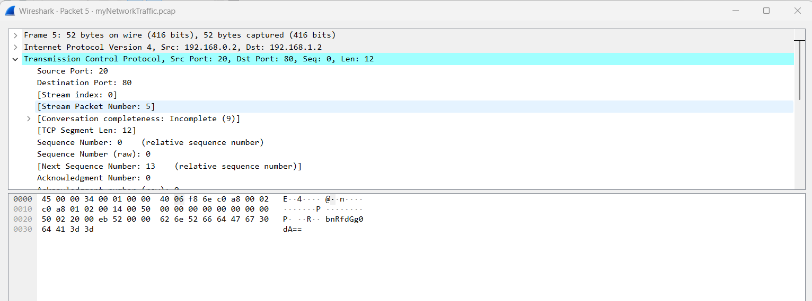
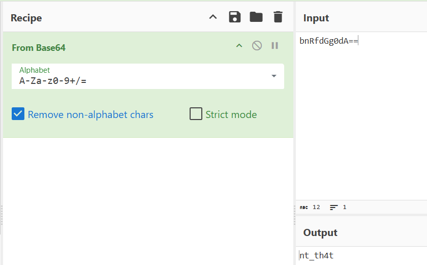
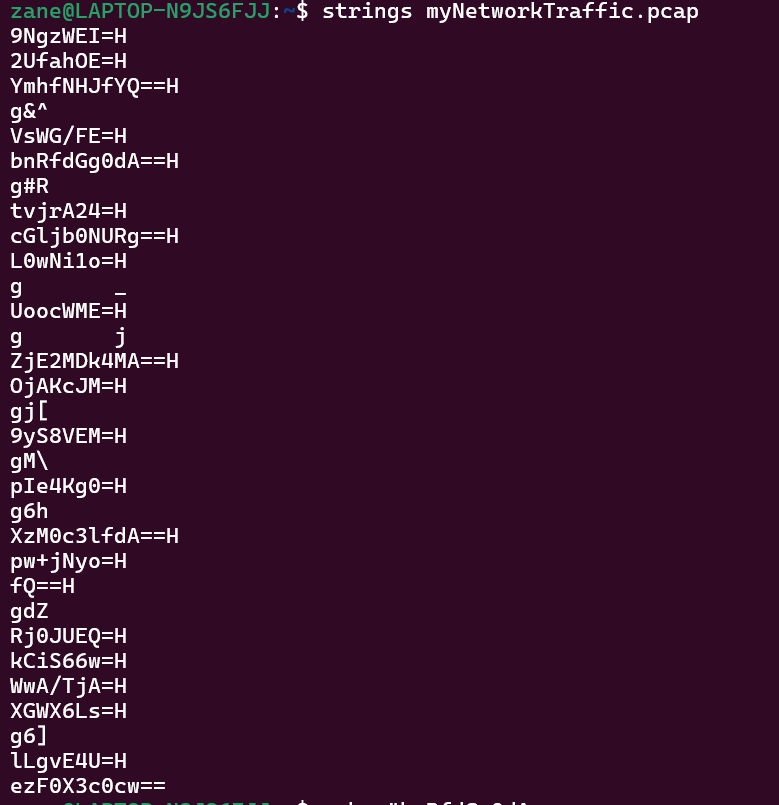
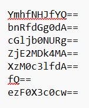
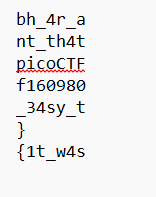

<!-- Masukkan Image Atau Vid Ke /content
Untuk memanggil bisa  _foto Beduaa_ 
Full Documentasi cara menulis bisa dilihat di https://chirpy.cotes.page/posts/write-a-new-post/
-->
# A Call from the Museum


## Deskripsi Soal

On a quiet mid-November evening, a fatigued CALE employee opened an unexpected email and,
without much thought, followed the instructions it contained. Moments later, something felt off,
panic set in, and he abruptly yanked the power cable from the wall to stop whatever had started.
One month later, that same email resurfaces as the crucial starting point of a cyber investigation,
holding the first clues to what really happened.

### Soal 1

Q1. Who is the suspicious sender of the email?

#### Penjelasan

Terdapat 2 file, Disini kita Analisa File yang berekstensi .eml, Format file `eml` adalah standar
penyimpanan pesan email yang menyimpan satu email utuh termasuk isi, subjek, pengirim,
penerima, tanggal, dan lampiran (attachment) dalam file teks biasa. Disini Saya buka
menggunakan Mousepad dan di dapat pengirimnya


#### Jawaban
eu-health@ca1e-corp.org

### Soal 2

Q2. What is the legitimate server that initially sent the email?

#### Penjelasan

Sama seperti soal sebelumnya, kita cukup menganalisa file tersebut dan di dapat server yang
mengirimkan emailnya



#### Jawaban
BG1P293CU004.outbound.protection.outlook.com

### Soal 3
Q3. What is the attachment filename?
#### Penjelasan

Untuk mengambil attachment yang berada di email, Disini saya menggunakan tools munpack
untuk mengekstrak file dari email



Dan disini terdapat nama file yang di cari

#### Jawaban
Health_Clearance-December_Archive.zip

### Soal 4
Q4. What is the Document Code?

#### Penjelasan
Setelah di ekstrak menggunakan munpack maka kita mendapatkan file zip namun, Untuk
mengekstrak file zipnya kita memerlukan password 



Setelah saya baca ceritanya, Di Poster tersebut terlihat jelas password untuk membuka zip ini



Setelah di ekstrak, Kita mendapatkan 2 File 



Dan di bagian PDF berisi kode untuk surat tersebut


#### Jawaban
EU-HMU-24X

### Soal 5
Q5. What is the full URL of the C2 contacted through a POST request?

#### Penjelasan

Disini Saya menganalisa file EU_Health_Compliance_Portal.lnk yang dimana .lnk sendiri
adalah file shortcut pada windows untuk mengakses sesuatu tanpa navigasi ke jalur filenya.
Disini saya menggunakan command string -el untuk membaca isi shortcut tersebut.


> strings -el dipakai saat file target kemungkinan menyimpan teks dalam encoding UTF-16 littleendian, terutama file dari lingkungan Windows.

Setelahnya saya mencoba untuk mengdecode url yang ada pada file tersebut


#### Jawaban
https://health-status-rs.com/api/v1/checkin

### Soal 6

Q6. The malicious script sent three pieces of information in the POST request. What is the
registry key from which the last one is retrieved?
#### Penjelasan

Sama seperti soal sebelumnya, Saya menganalisa File EU_Health_Compliance_Portal.lnk
yang dimana terdapat salah satu registry key pada windows yakni
HKLM\SOFTWARE\Microsoft\Cryptography\MachineGuid yang dimana berisi identifier
unik untuk instalasi Windows pada sistem


#### Jawaban

HKLM\SOFTWARE\Microsoft\Cryptography\MachineGuid

### Soal 7
Q7. Then the script downloads and executes a second stage from another URL. What is the
domain?

#### Penjelasan

Selain https://health-status-rs.com/api/v1/checkin terdapat satu url lagi pada malware tersebut


yang dimana jika kita decode hasilnya

#### Jawaban

advent-of-the-relics-forum.htb.blue

### Soal 8
Q8. A set of credentials was used to access the previous resource. Retrieve them.
#### Penjelasan

Selanjutnya kita harus mencari credential yang digunakan, Disini saya tertarik dengan baris
```shell
$Bs = (-join('Basic c3','ZjX3Rlb','XA6U2','5','vd0JsY','WNrT','3V','0X','zIwM','jYh'));
```
yang dimana jika kita gabungkan maka akan menjadi `Basic
c3ZjX3RlbXA6U25vd0JsYWNrT3V0XzIwMjYh` Jika melihat dari alurnya ini merupakan http
authorization header Basic Auth. 

Dan jika kita decode dengan menghilangkan kata basicnya maka akan jadi


#### Jawaban

svc_temp:SnowBlackOut_2026!
